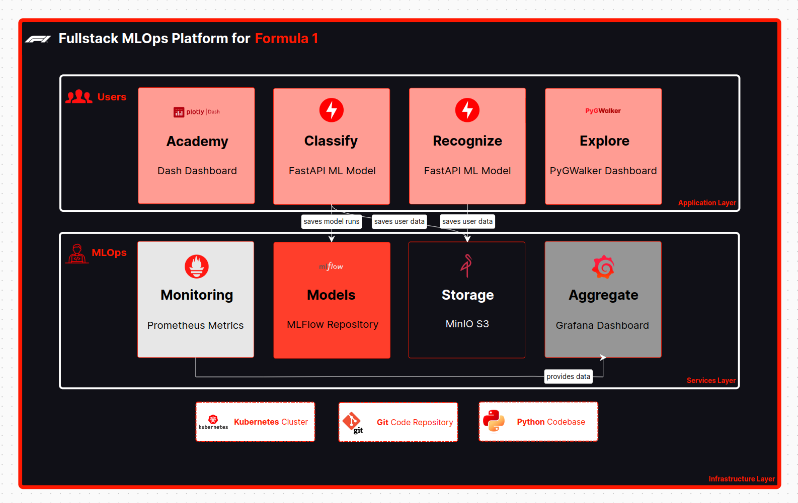

# f1-mlops-platform-general
Repository holding general files for whole Fullstack MLOps Platform for Formula 1 project.

# Platform 
## Architecture


## Components

| Name      | Description |
| ----------- | ----------- |
| [Academy](https://gitlab.com/formula-1-fullstack-mlops/platform-components-helm-charts-repository/dash-helm)      | Grafana Dashboard - of Driver Telemetry data (based on F1 2019 PS4 Game)       |
| [Classify](https://gitlab.com/formula-1-fullstack-mlops/formula-one-image-classification-model)   | FastAPI ML Model - for F1 Cars Image Classification of Teams        |
| [Recognize](https://gitlab.com/formula-1-fullstack-mlops/formula-one-recognition-model)   | FastAPI ML Model - for Image/Video F1 Cars Recognition and Classification of Teams        |
| [Explore](https://gitlab.com/formula-1-fullstack-mlops/platform-components-helm-charts-repository/pygwalker-helm)   | PyGWalker Dashboard - of F1 Historical Dataset        |
| [Monitoring & Aggregate](https://gitlab.com/formula-1-fullstack-mlops/platform-components-helm-charts-repository/prometheus-stack-helm)   | Grafana Dashboard - based on Prometheus logged data        |
| [Models](https://gitlab.com/formula-1-fullstack-mlops/platform-components-helm-charts-repository/mlflow-helm)   | MLFlow Repository - of model runs and experiments        |
| [Storage](https://gitlab.com/formula-1-fullstack-mlops/platform-components-helm-charts-repository/minio-helm)   |  MinIo S3 - object-based storage         |

## Codebase
- Python 3.12.2
- Minikube 1.32.0
- Git 2.34.1

# Deployment
```
# Initial Setup
helm repo add prometheus-community https://prometheus-community.github.io/helm-charts
helm repo update

# Setup Services layer
helm install prometheus prometheus-community/kube-prometheus-stack -n f1-platform
helm install prometheus-stack ./prometheus-stack-helm/
helm install minio ./minio-helm/
helm install mlflow ./mlflow-helm/

# Setup Application Layer
helm install dash ./dash-helm/
helm install image-classification-model ./image-classification-model-helm/
helm install recognition-model ./recognition-model-helm/
helm install pygwalker ./pygwalker-helm/
```